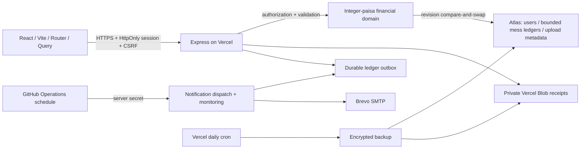

# MERN architecture

The browser never has database, SMTP, Blob or cron credentials. Invitation tokens are hashed at rest. Every mess route checks membership; every mutation revalidates role and document revision. See UPGRADE_2026_09.md for limits, failure semantics and rollback.
