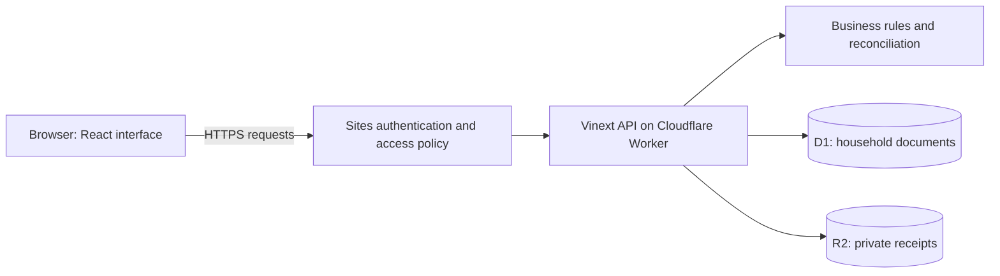
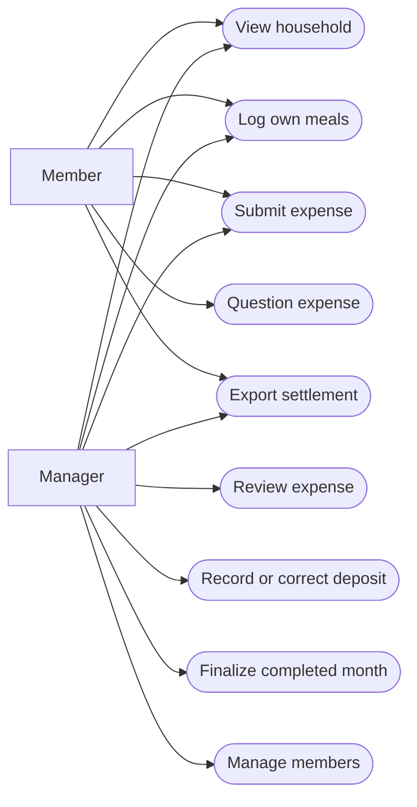
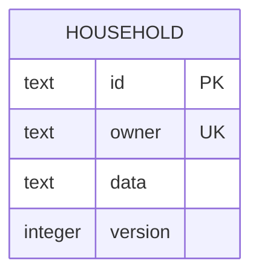
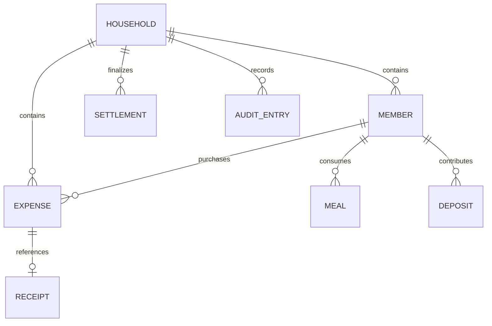
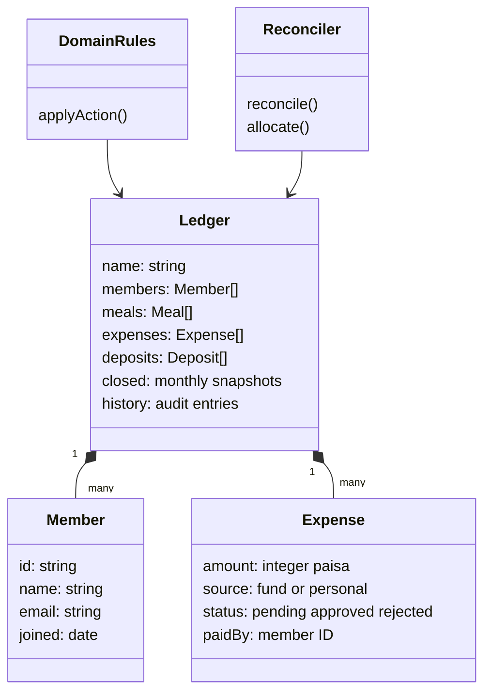
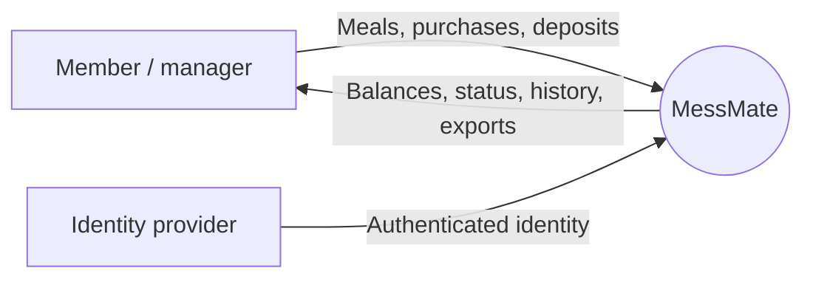
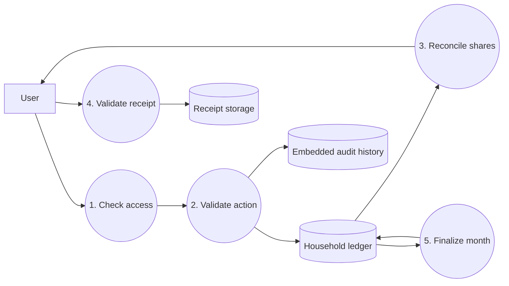
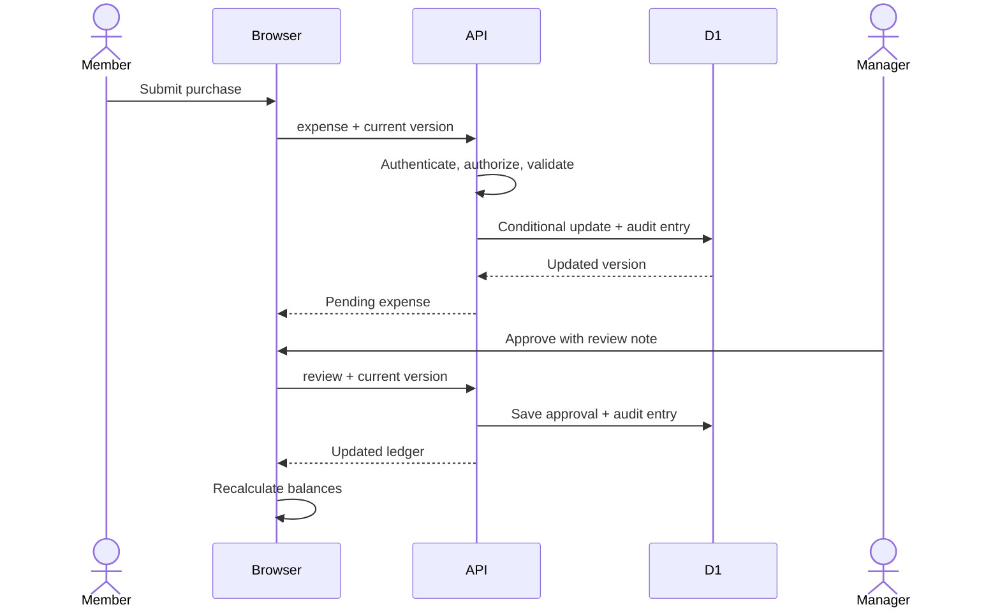
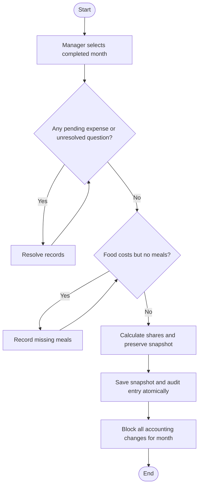

# System design and diagrams

These diagrams describe the implementation rather than a hypothetical different stack. Mermaid blocks render in GitHub. In draw.io, use **Insert → Advanced → Mermaid** where available, or recreate the shapes described below.

## Architecture

Use rectangles for components, cylinders for storage and arrows for requests. The frontend does not talk directly to storage.

## Use cases

In draw.io use UML actors for Member/Manager and ellipses for the actions. Connect each actor to the actions it is allowed to perform.

## Storage ER diagram

The physical database contains one table. Its JSON field embeds the logical entities below; the relationships are enforced in application code, not SQL foreign keys.

Use entity rectangles and crow's-foot connectors. One member has many meals; each meal refers to one member. Member/date is unique in the application. One expense may reference zero or one receipt object. A user can participate in multiple households through invitations.

## Class diagram

Boxes group fields and behavior; arrows indicate use or containment. TypeScript uses data types and functions rather than implementing every box as a runtime class.

## DFD Level 0

The circle is the whole process. Rectangles are external actors. Arrows name the information exchanged.

## DFD Level 1

Each numbered circle is a sub-process. History is embedded in the same atomic document update as the ledger, not a separate physical database.

## Expense approval sequence

Use actor/lifeline shapes across the top and horizontal message arrows in time order. A stale version produces a conflict response instead of a write.

## Month finalization activity

Rounded rectangles mark start/end, rectangles are actions, and diamonds are decisions.

## Design trade-offs

The single-document design makes a household update atomic and easy to understand, but has bounded capacity and scans invited emails. It is suitable for a small mess. A future normalized design would split household membership, meal, expense, deposit, receipt and audit tables and add database-level foreign keys and indexes. Do not claim that the current implementation is normalized.
