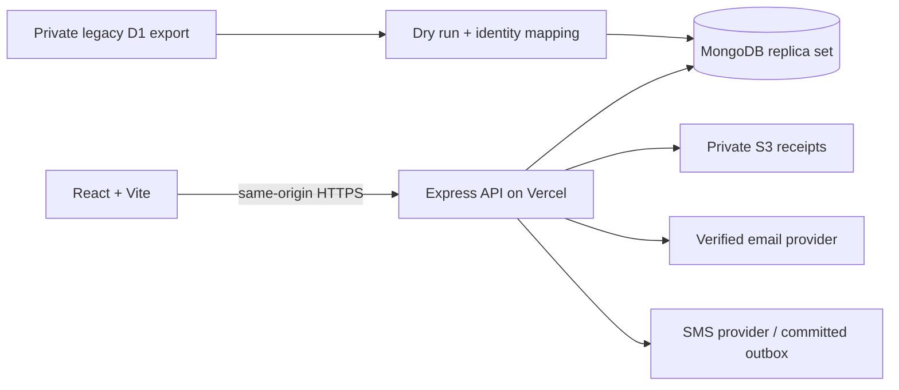

# API and architecture

Routes/authentication live in `server/src/app.ts`, validation/financial transitions in `domain.ts`, persistence/indexes in `models.ts`, provider adapters in `providers.ts`, outbox dispatch in `notifications.ts`. `rate-limit.ts` uses shared MongoDB counters to cover multiple function instances. `api/index.ts` reuses connections on Vercel.

State-changing requests need the exact `Origin: APP_URL`. Authenticated mutations also need `x-csrf-token` returned by login or `/api/me`. Authentication uses a 7-day HttpOnly/SameSite=Lax cookie, Secure in production. Passwords use salted scrypt. Reset consumes a hashed one-use ticket transactionally and revokes all sessions. No frontend bearer secrets.

| Method/path                             | Behavior                                              |
| --------------------------------------- | ----------------------------------------------------- |
| POST `/api/auth/register`               | Name/email/password; real verification mail required  |
| POST `/api/auth/resend`, `/forgot`      | Generic response after an eligible real provider send |
| POST `/api/auth/verify`, `/reset`       | One-use token; reset includes new password            |
| POST `/api/auth/login`, `/api/logout`   | Create/revoke opaque session                          |
| GET/PATCH `/api/me`                     | Profile, Bangladesh phone and SMS consent             |
| GET/POST `/api/messes`                  | Membership list/create                                |
| GET `/api/messes/:id`                   | Authorized household view, revision, current role     |
| POST `/api/messes/:id/invites`          | Admin generates an expiring email-bound invitation    |
| POST `/api/invites/accept`              | Verified recipient consumes invitation                |
| POST `/api/messes/:id/actions`          | Validated atomic domain transition                    |
| GET `/api/messes/:id/settlement/:month` | Current calculation or immutable snapshot             |
| POST `/api/messes/:id/files`            | Private multipart receipt/QR, membership check        |
| GET `/api/messes/:id/files/:file`       | Authorized private attachment download                |
| GET `/api/messes/:id/export`            | Admin-only ledger backup                              |
| GET `/api/health`, `/api/ready`         | Process and database readiness                        |
| GET `/api/jobs/notifications`           | Vercel adapter only; server Bearer secret required    |

Action envelope: `{action, payload, revision, requestId}`. `requestId` must be a UUID reused for a retry. Revision is the last fetched integer. MongoDB compare-and-swap updates financial records, audit, idempotency and outbox together. Concurrent conflicting requests return 409. Authenticated role/member scope comes from the database, never from user-supplied roles or mess membership.

Actions: `settings`, `rules`, `manager`, `member_leave`, `account`, `deposit_submit`, `deposit_cash`, `deposit_review`, `deposit_void`, `menu`, `meal`, `meal_range`, `recurring`, `correction_request`, `correction_review`, `duty`, `duty_complete`, `advance`, `advance_return`, `expense`, `expense_review`, `transfer`, `stock`, `notice`, `read_notification`, `close`.

Wallet submissions never move money. Approvals require a manager's explicit recipient/reference/amount verification. Voiding an approved deposit reverses credit and is not a cash refund. Money transfers are separately recorded actual payouts. Expense funding source prevents counting advance funding and its purchase twice. Allocation uses integer largest-remainder rounding and conserves original costs. Closing blocks zero-meal unallocated costs, pending reviews and unreconciled advances.

Uploads validate size and file signatures, return private keys and require membership to download. Keys supplied on actions must belong to the same mess. They are not scanned for malware; attachments are served with a sandbox policy. Vercel's request-size limit can be lower than the standalone 5 MB limit.
